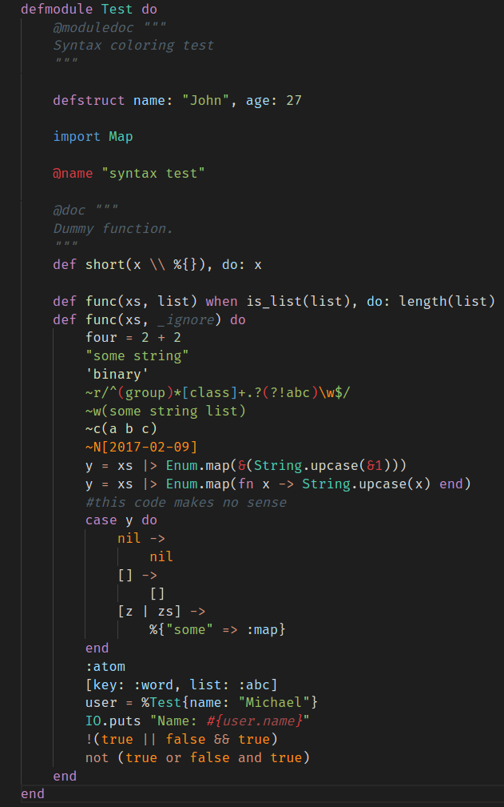

# Dark+(Elixir)

Elixir customized syntax based on a default dark+

## Usage

    "workbench.colorTheme": "dark-plus-elixir",

**Note:** For non-elixir files, this syntax should look the same as dark+
## Elixir files

## Templates files

